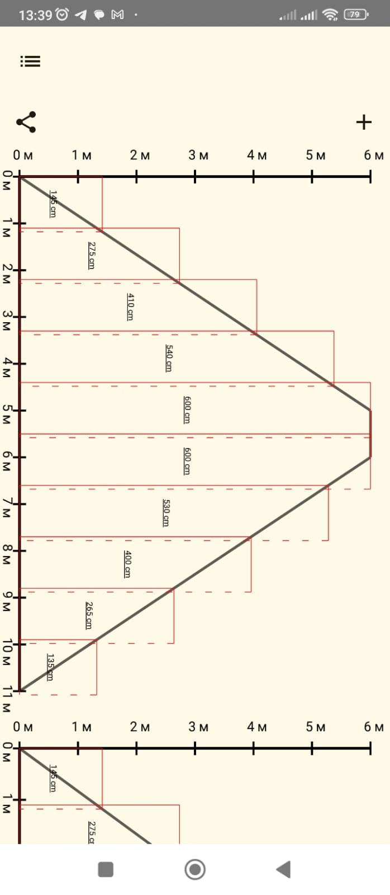
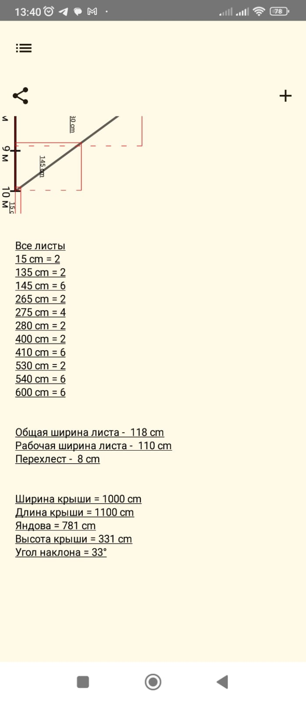
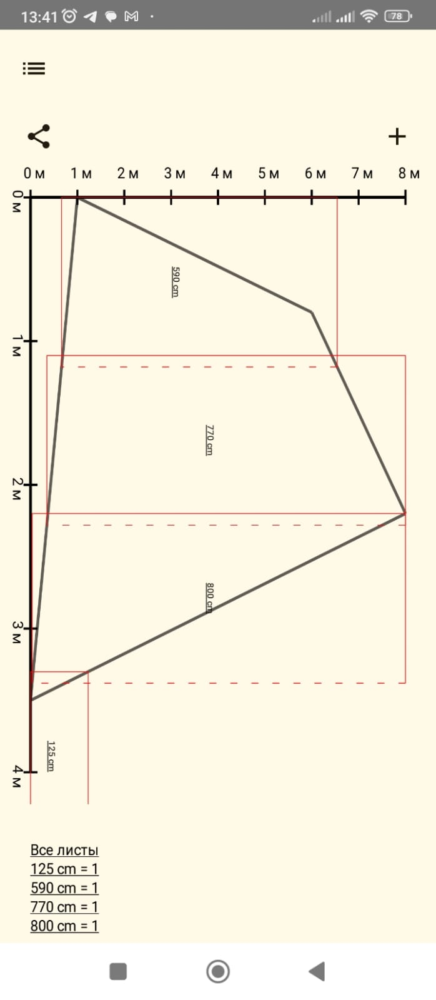
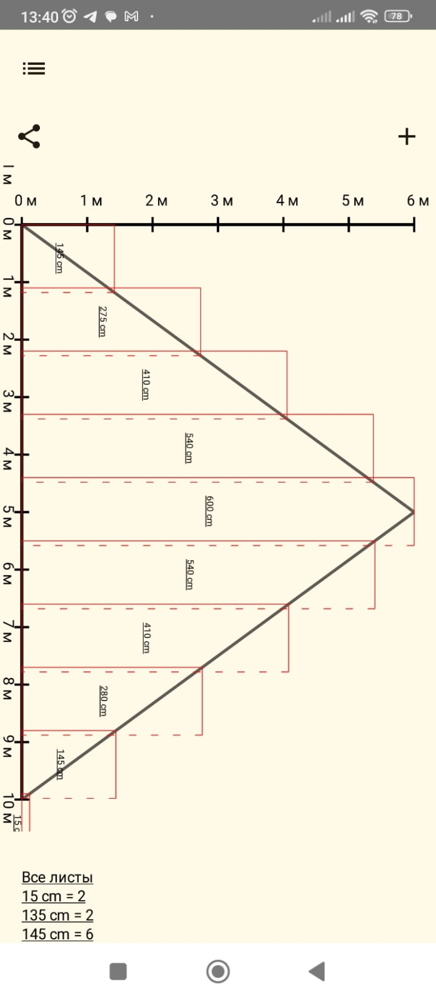

# Roof_app

Проект, созданный для помощи кровельщикам. Он предоставляет схему раскладки листов железа на
выбранную ими фигуру или стандартную крышу и сохраняет эту схему в PDF-документе. Это помогает
избежать ошибок, которые могут возникнуть при работе в кровельных центрах с людьми, не имеющими
опыта в данной сфере.





## Требования

- **Android SDK**: 26-34
- **Сторонние библиотеки**:
    - AndroidX
    - Compose
    - Hilt
    - Navigation
    - Kotlin Coroutines

## Установка

1. Клонируйте репозиторий:
    ```bash
    git clone https://github.com/pavlig43/roof_app.git
    ```
2. Перейдите в папку проекта:
    ```bash
    cd roof_app
    ```
3. Откройте проект в Android Studio и дождитесь завершения загрузки зависимостей.
4. Запустите проект на вашем устройстве или эмуляторе.

## Использование

1. Задайте параметры крыши для получения раскладки листов на всю крышу.
2. Или задайте координаты точек на декартовой плоскости для получения раскладки на заданной фигуре.
3. Сохраните полученный расклад в виде PDF-файла.
4. Вы можете поделиться полученными PDF-файлами с другими людьми.

## Вклад

1.Функционал для расширения: Реализуйте возможность передачи документа на печать на принтер прямо с
телефона.
2.Функция для работы с координатами: Напишите функцию расширения для списка точек на координатной
плоскости, образующих многоугольник. Эта функция должна возвращать две точки пересечения линии (
параллельной оси X) с этим многоугольником.   
